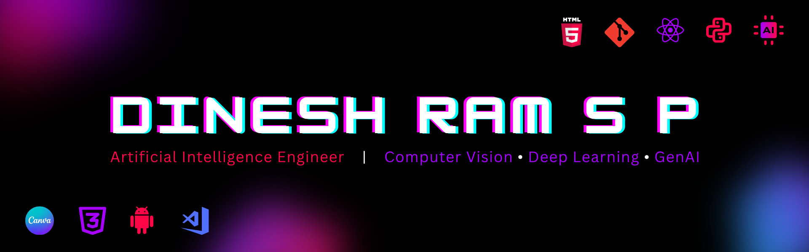

<!-- ========================================= -->
<!-- HEADER BANNER -->
<!-- ========================================= -->

  

<h1 align="center">Hi 👋, I'm Dinesh Ram S P</h1>

  

  

---

# 🚀 About Me

🎓 MTech in Artificial Intelligence at Amrita Vishwa Vidyapeetham

🧠 Passionate about:

- Artificial Intelligence
- Deep Learning
- Computer Vision
- Explainable AI (XAI)
- Generative AI

🌱 Currently:

- Preparing for placements
- Working on AI research
- Building practical AI solutions
- Exploring Agentic AI systems

📍 Dindigul, Tamil Nadu, India

---

# 💻 Tech Stack

## Programming Languages

## AI & Machine Learning

## Cloud

## Development

---

# 🔬 Featured Projects

## 🩺 Multi-Class Oral Cancer Classification

- Developed a multi-class oral cancer classification pipeline
- U-Net based segmentation
- EfficientNetV2 classification
- Grad-CAM explainability
- PyTorch implementation

🔗 Repository: [Link will be added soon...]

---

## 🌍 Land Cover Detection Using Deep Learning

- SpectralFormer based classification
- Multispectral satellite imagery
- Google Cloud deployment
- Interactive web interface

🔗 Repository: [Link will be added soon...]

---

## 💧 Smart Water Quality Monitoring System

- IoT-based monitoring system
- ESP32 and sensors
- XGBoost prediction model
- Flask dashboard
- MQTT communication

🔗 Repository: [Link will be added soon...]

---

# 📄 Research

### Paper accepted in the conference (ICCCSP 2026)

📝 Multi-Class Oral Cancer Classification Using RfficientNetV2

Research focused on improving oral cancer diagnosis using segmentation, classification and explainable AI techniques.

---

# 📜 Certifications

- Meta Android Developer Professional Certificate
- Cisco Certified Network Associate (CCNA)
- NPTEL Problem Solving Through Programming in C
- NPTEL Joy of Computing Using Python
- Infosys Springboard Data Structures and Algorithms Using Python
- Infosys Springboard Database Management Systems

---

# 📈 GitHub Statistics

---

# 🔥 GitHub Streak

  

---

# 📊 Contribution Graph

---

# 🌐 Connect With Me

  

  

  

---

# ⚡ Fun Fact

I enjoy building AI systems that solve real-world problems, from healthcare and satellite imagery analysis to IoT-powered smart monitoring solutions.
